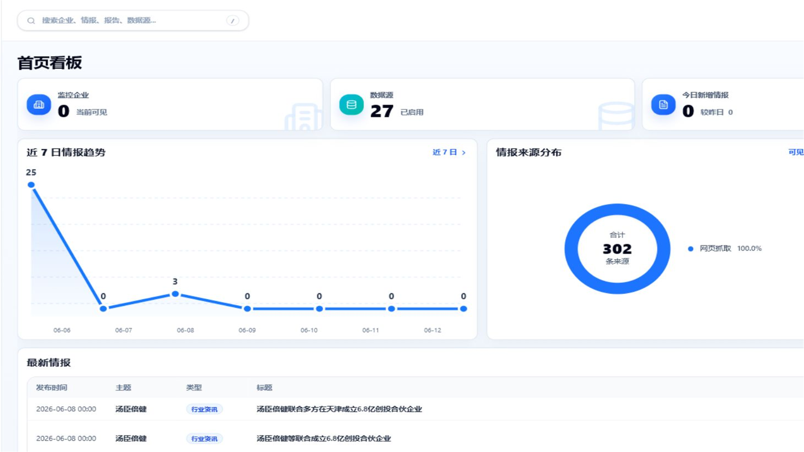
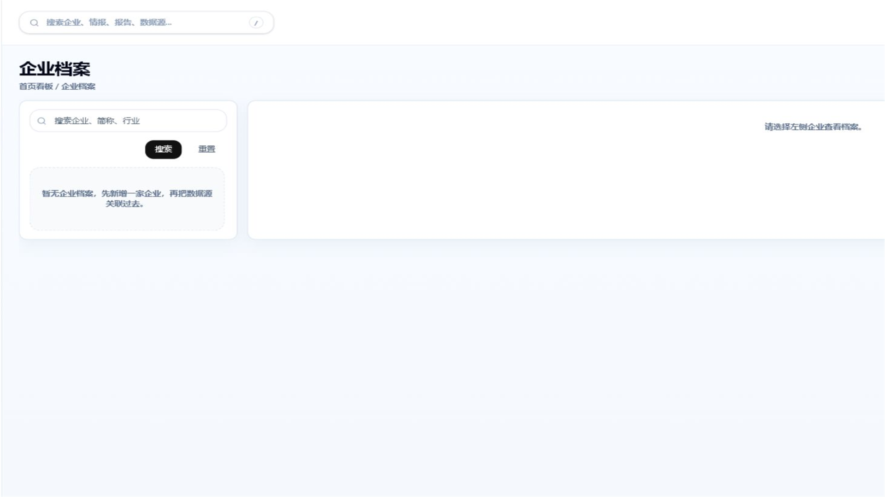
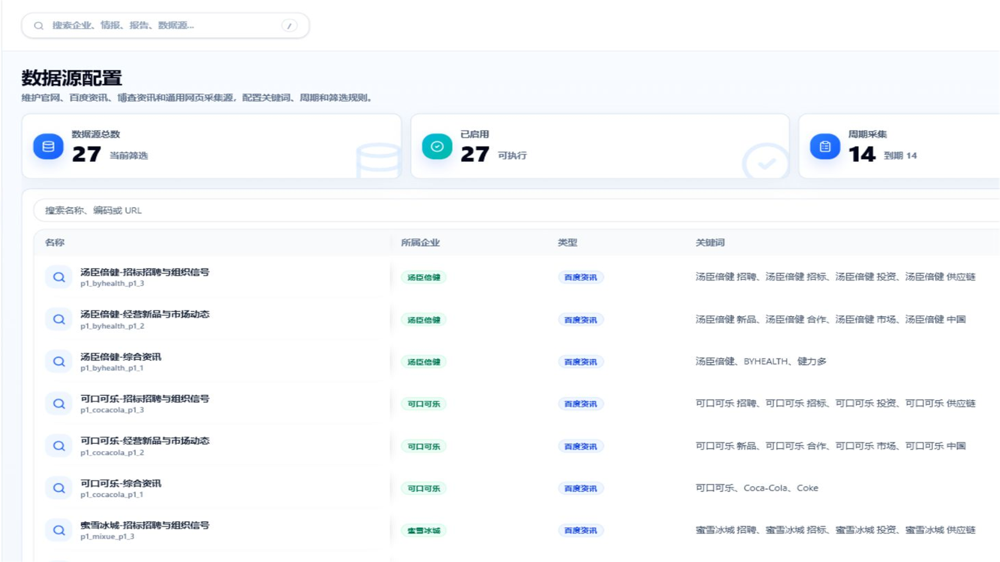
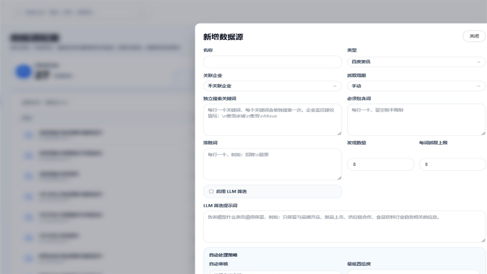
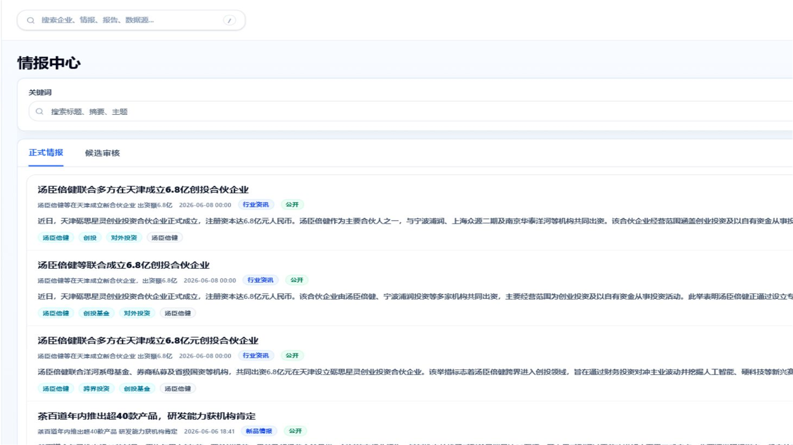
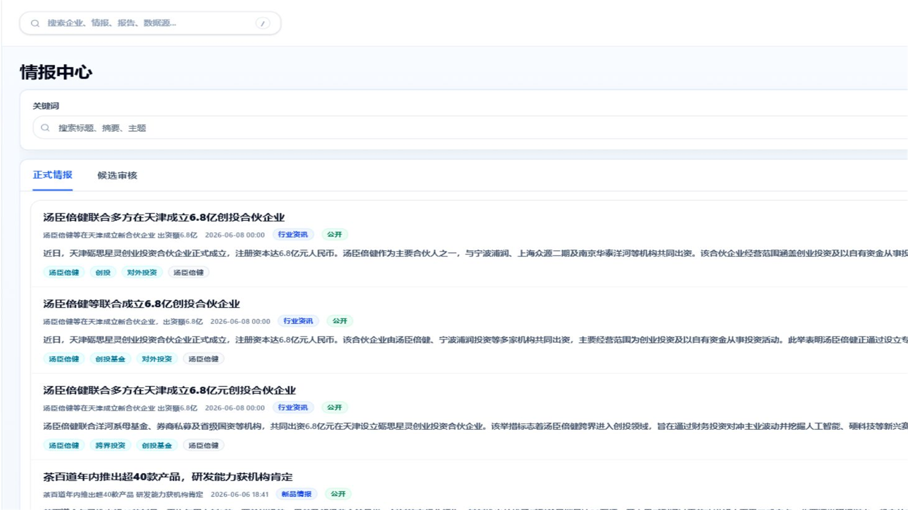
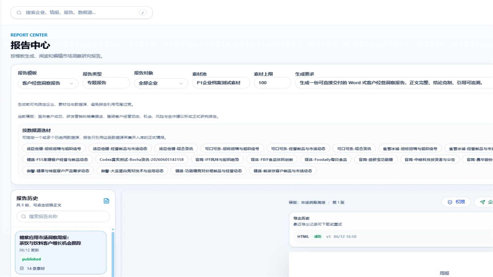
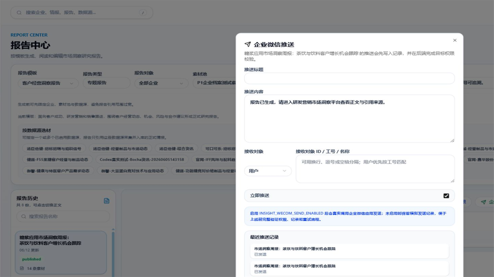
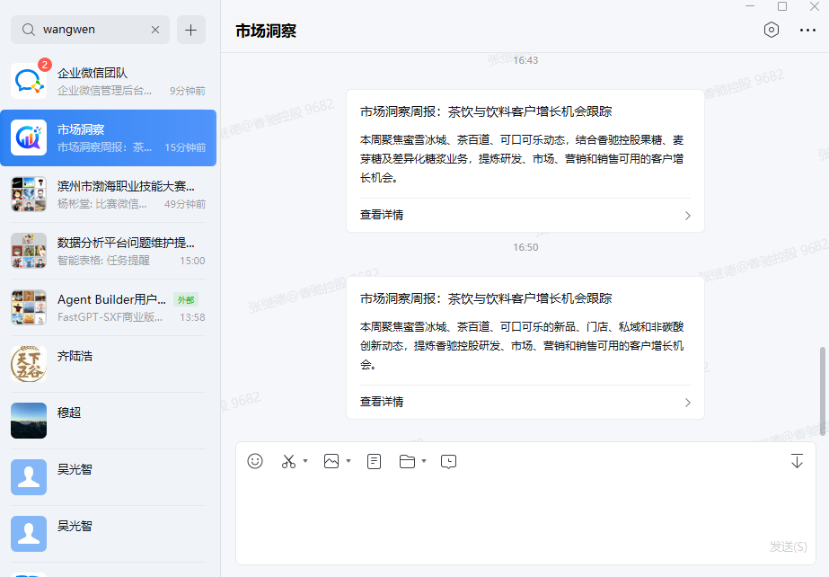
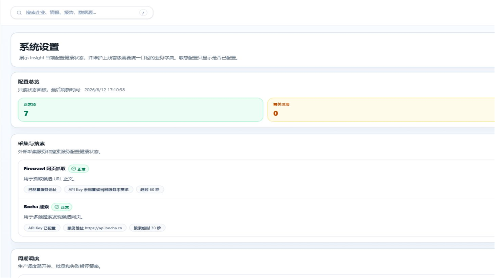

# 研发营销市场洞察平台正式操作手册

文档类型：用户操作手册  
适用模块：研发营销市场洞察平台（`/insight/*`）  
适用对象：研发、市场、营销、销售、情报维护人员、数据源管理员、报告维护人员、系统管理员  
版本日期：2026-06-12

## 1. 手册说明

研发营销市场洞察平台用于持续沉淀外部市场信息、客户动态、竞品动作、新品趋势和公开资料证据，服务研发选题、销售跟进、市场判断和管理层周报输出。

本手册面向日常使用和业务维护人员，重点说明企业、数据源、情报、报告模板和企业微信推送的维护方法。手册不包含后台运维、接口调试和系统部署等内容。

平台中的报告和情报应以公开来源、可追溯证据和人工复核为基础。报告对外发送前，应确认链接可访问、证据可追溯、内容范围与接收人权限一致。

## 2. 角色与维护范围

| 角色 | 主要职责 |
| --- | --- |
| 普通使用人 | 查看首页看板、检索正式情报、阅读企业档案、查看和打开报告。 |
| 情报维护人员 | 审核候选情报，维护正式情报标题、摘要、正文、标签、证据和素材池。 |
| 数据源管理员 | 新增和维护采集源，设置关键词、采集周期、筛选规则、启停状态和执行测试。 |
| 报告维护人员 | 维护报告模板、生成周报、编辑报告版本、导出 HTML、发起企业微信推送。 |
| 系统管理员 | 维护标签字典、系统配置状态、用户权限、可见性规则和账号映射。 |

## 3. 登录与导航

1. 打开 AI Platform 并完成登录。
2. 进入市场洞察入口，或直接访问 `/insight`。
3. 通过左侧导航进入首页看板、情报中心、企业档案、报告中心、数据源配置和系统设置。
4. 如提示无权限或数据为空，先确认当前账号所属部门、角色和显式授权，再检查对应企业、数据源、情报或报告是否已授权。

图 1：首页看板

## 4. 日常维护总流程

市场洞察的日常维护建议按以下顺序执行：

1. 维护企业或主题：先在企业档案中确认客户、竞品或观察对象是否存在。
2. 维护数据源：为企业或主题配置搜索关键词、来源类型、采集周期和筛选规则。
3. 执行测试采集：用手动测试验证数据源是否能产生候选情报。
4. 审核候选情报：对候选内容执行通过、驳回或忽略。
5. 维护正式情报：补充标题、摘要、正文、来源证据、标签、权限和报告素材标记。
6. 生成报告：在报告中心选择模板、对象、素材范围和生成要求。
7. 复核并导出：检查报告正文、证据和链接，导出 HTML。
8. 推送通知：使用企业微信推送时，卡片应包含标题、简介和可访问链接。

## 5. 企业与主题维护

### 5.1 新增企业

1. 进入“企业档案”。
2. 点击“新增企业”。
3. 填写企业名称、简称、行业、区域、企业类型、官网、监控级别和描述。
4. 保存后，在企业详情中继续配置数据源、权限和关联情报。

### 5.2 查看企业档案

1. 在搜索框输入企业名称、简称或行业关键词。
2. 点击企业卡片进入详情。
3. 查看基础信息、重点情报、关联数据源、标签和近期动态。
4. 需要从企业视角继续分析时，可点击关联情报进入情报中心。

### 5.3 维护企业权限

1. 打开企业详情中的权限入口。
2. 按用户、角色、部门或全员配置查看、编辑或拥有者权限。
3. 对敏感客户、重点竞品和战略项目，建议使用受限可见范围。
4. 跨部门共享时优先授权部门或角色，减少逐个用户维护。

图 2：企业档案

## 6. 数据源维护

数据源是市场信息进入平台的入口。新增或调整数据源后，应先测试，再进入周期采集。

### 6.1 新增数据源

1. 进入“数据源配置”。
2. 点击“新增数据源”。
3. 填写数据源名称。
4. 选择数据源类型，例如百度资讯、博查资讯、博查网页、官网、通用网页或多源资讯。
5. 选择所属企业；如不归属具体企业，可选择不关联企业。
6. 填写基础 URL 或搜索关键词。
7. 设置采集周期，可选手动、每 15 分钟、每小时、每天或自定义 Cron。
8. 填写包含词、排除词、最大结果数和抓取数量。
9. 如需 AI 辅助筛选，开启 LLM 筛选并填写筛选提示词。
10. 按业务需要选择是否自动审核。
11. 将状态设为“已启用”并保存。

图 3：数据源配置

图 4：新增数据源

### 6.2 编辑、启停和删除

1. 在数据源列表中找到目标数据源。
2. 点击“编辑”可调整名称、关键词、周期、筛选规则和可见范围。
3. 点击“启用”或“停用”控制是否参与采集和调度。
4. 点击“加入下一轮调度”可让该数据源进入下一次周期扫描。
5. 删除前应确认该数据源不再承担正式采集任务，并确认历史情报仍能保留必要来源信息。

### 6.3 测试数据源

1. 在数据源列表中选中目标数据源。
2. 点击“测试”打开测试侧栏。
3. 如需临时调整关键词，可填写临时覆盖关键词。
4. 点击“测试当前数据源”。
5. 查看发现数、抓取数和候选数。
6. 如产生候选情报，可点击“查看该数据源候选情报”进入候选审核。
7. 如测试失败，先查看错误提示和执行日志，再调整关键词、URL、来源类型或采集频率。

### 6.4 批量导入数据源

1. 点击“批量导入”。
2. 按页面要求填写或粘贴数据源配置。
3. 提交导入后，先抽样测试重点数据源。
4. 质量稳定后，再开启较高频率的周期采集。

### 6.5 调度器和执行日志

1. 点击“调度器”查看后台周期采集状态、扫描间隔、最近扫描时间和任务日志。
2. 点击“立即扫描到期任务”可手动触发到期数据源扫描。
3. 点击“日志”查看最近执行记录。
4. 日志中重点关注状态、开始时间、结束时间、发现数、抓取数、候选数和失败原因。

## 7. 情报中心维护

情报中心包含“正式情报”和“候选审核”。正式情报用于检索、企业档案聚合和报告生成；候选审核用于入库前筛选。

### 7.1 查看正式情报

1. 进入“情报中心”。
2. 确认当前位于“正式情报”页签。
3. 在关键词中输入标题、摘要或主题关键词。
4. 可按主题类型、情报类型、来源或数据源继续筛选。
5. 点击情报标题进入详情。
6. 对适合报告引用的情报，点击“加入报告素材”。

图 5：情报中心 - 正式情报

### 7.2 审核候选情报

1. 切换到“候选审核”页签。
2. 阅读候选标题、摘要、来源、质量分、质量问题和系统建议。
3. 点击“通过”，候选会转为正式情报。
4. 点击“驳回”，用于处理明显无关或不适合入库的内容。
5. 点击“忽略”，用于处理重复、低价值或暂不处理内容。
6. 审核后应抽查正式情报中的摘要、来源和标签是否准确。

### 7.3 维护正式情报详情

1. 打开正式情报详情。
2. 阅读标题、来源、发布时间、主题、信息类型、摘要和正文。
3. 点击“编辑情报”维护标题、摘要、正文、类型、重要性和可见性。
4. 点击“补充来源”维护来源标题、来源类型、来源 URL、发布时间或内容摘录。
5. 点击“权限”维护查看、编辑或拥有者规则。
6. 点击“收藏”“稍后看”或“报告素材”完成个人和报告场景标记。

图 6：情报详情

### 7.4 人工新增情报

1. 在情报中心点击“新增情报”。
2. 填写标题、摘要、正文、主题类型、情报类型、重要性和可见范围。
3. 填写来源 URL、来源标题或内容摘录，保证证据可追溯。
4. 保存后，在正式情报列表中复核展示效果。

人工新增情报至少应包含标题、摘要、正文和来源信息。缺少来源证据的内容不建议直接用于正式报告交付。

## 8. 报告中心维护

报告中心用于从正式情报和报告素材池生成周报、客户跟进报告和专项分析报告。

### 8.1 生成报告

1. 进入“报告中心”。
2. 选择报告模板。
3. 填写报告类型和报告对象。
4. 选择素材池，默认可使用“默认报告素材”。
5. 设置素材上限。
6. 如需缩小范围，可按数据源选材。
7. 在生成要求中写明报告侧重点，例如“突出研发机会、客户新品和销售跟进线索”。
8. 点击“生成报告”。
9. 生成成功后，在报告历史中打开新报告。

图 7：报告中心

### 8.2 复核和编辑报告

1. 在报告历史中打开目标报告。
2. 阅读摘要、关键发现、机会、风险和引用来源。
3. 检查报告是否覆盖目标客户、目标产品和销售可用信息。
4. 如报告泛泛，应返回情报中心补充更高价值素材，或在生成要求中明确报告对象、场景和筛选范围。
5. 如需人工修订，在正文编辑区调整内容。
6. 点击“保存版本”保留人工编辑记录。

### 8.3 导出 HTML

1. 打开目标报告。
2. 点击“导出 HTML”。
3. 导出成功后，打开 HTML 链接检查排版、证据和跳转。
4. 对外发送时，链接应使用局域网 IP 或正式域名，不使用 `localhost`。
5. 如导出失败，可在导出历史中查看原因并重试。

### 8.4 维护报告模板

1. 点击“自定义模板”进入模板管理。
2. 选择系统模板或市场模板并应用。
3. 可复制市场模板为个人模板后再调整。
4. 维护模板名称、说明、报告类型、默认提示词和章节结构。
5. 可上传 `.docx` 或 `.xlsx` 模板用于解析结构和生成约束。
6. 发布到模板市场前，应确认模板适用范围、章节命名和权限规则。

### 8.5 维护生成偏好

1. 点击“生成偏好”。
2. 保存常用默认模板、报告类型、素材池、素材上限和生成要求。
3. 保存后，下次生成报告时可自动带出常用配置。

## 9. 企业微信推送

企业微信推送用于把报告或情报通知到指定人员。当前阶段应先确认推送记录、链接可访问性和账号映射。

### 9.1 推送前检查

1. 当前账号有目标报告或情报的查看权限。
2. 接收人账号存在，且平台用户工号与企业微信账号映射一致。
3. 报告链接使用局域网 IP 或正式域名，不使用 `localhost`。
4. 报告权限设置为接收人可访问，或测试场景已明确使用公开链接。
5. 推送卡片只展示标题、简介和“查看详情”，不展示内部调试文字、证据 ID 或生成过程。

### 9.2 发起推送

1. 打开目标报告或情报详情。
2. 点击“企微推送”。
3. 填写推送标题。标题应明确报告主题，例如“市场洞察周报：茶饮与饮料客户增长机会跟踪”。
4. 填写简介。简介应概括本期重点，例如新品、渠道、客户动态和销售机会。
5. 填写接收人工号或选择接收范围。
6. 提交推送。
7. 推送后检查推送记录状态和企业微信接收效果。

图 8：企微推送窗口

图 9：企业微信接收效果

## 10. 系统设置与字典维护

系统设置用于查看配置健康状态和维护业务字典。普通业务用户只需关注与数据可用性、推送和标签相关的项目。

### 10.1 查看配置状态

1. 进入“系统设置”。
2. 查看采集、调度、推送、报告和登录配置状态。
3. 如配置显示未启用或需关注，联系管理员确认环境变量、服务状态或账号映射。
4. 敏感配置只显示是否已配置，不显示明文。

### 10.2 维护标签字典

1. 在“标签字典”中输入标签名称。
2. 选择标签类型，例如业务标签、主题标签、风险标签或产品标签。
3. 点击“新增”。
4. 对已有标签可执行编辑或禁用。
5. 禁用标签不会删除历史情报，只会阻止后续作为启用标签继续使用。

### 10.3 查看情报类型字典

情报类型字典用于统一筛选、展示和报告约束。页面展示类型名称、编码、说明和使用量。如需新增或调整情报类型，应先完成业务口径确认，再按变更流程处理。

图 10：系统设置

## 11. 权限与数据可见性

市场洞察平台的权限过滤在后端完成，前端隐藏不作为权限边界。

常见可见范围包括：

1. 公开或全员可见。
2. 仅拥有者可见。
3. 指定用户可见。
4. 指定角色可见。
5. 指定部门可见。

常见权限级别包括：

1. 查看：可阅读列表和详情。
2. 编辑：可修改内容、审核候选或维护配置。
3. 拥有者：可维护权限和执行高风险操作。

维护建议：

1. 企业、数据源、情报、报告和模板应分别复核权限。
2. 报告推送前，应确认报告本身和引用情报均不包含越权内容。
3. 排查“看不到数据”时，优先检查用户所属部门、角色和显式授权规则。

## 12. 常见问题处理

### 12.1 首页没有数据

1. 检查当前账号是否有企业、数据源、情报或报告权限。
2. 检查数据源是否存在且已启用。
3. 检查数据源是否已测试并产生候选情报。
4. 检查候选情报是否已审核通过。
5. 检查调度器是否启用，或手动触发到期任务。

### 12.2 数据源测试失败

1. 查看测试侧栏中的错误提示。
2. 打开执行日志查看失败原因。
3. 检查关键词是否过宽或过窄。
4. 检查基础 URL 是否可访问。
5. 必要时降低采集频率、减少抓取数量或更换来源类型。

### 12.3 候选情报质量差

1. 增加包含词，减少无关内容。
2. 增加排除词，过滤广告、招聘、无关资讯和重复内容。
3. 优化 LLM 筛选提示词。
4. 降低最大结果数和抓取数量，优先保证质量。
5. 对长期低价值来源执行停用或降频。

### 12.4 报告内容泛泛

1. 先按摘要筛选素材，必要时打开原文或正文进行复核。
2. 优先选择与报告对象、客户场景、产品机会和销售跟进相关的正式情报。
3. 在生成要求中明确客户范围、产品范围、输出重点和不需要展开的方向。
4. 对新品、门店、渠道、营销活动和客户公开动态，应优先保留可追溯证据。
5. 生成后如仍缺少深度，应补充更高价值素材后重新生成。

### 12.5 HTML 链接打不开

1. 检查链接是否使用 `localhost`。发送给他人时应使用局域网 IP 或正式域名。
2. 检查报告文件是否已成功导出。
3. 检查报告是否为公开测试链接，或接收人是否具备访问权限。
4. 如仍无法访问，联系管理员检查前端静态文件服务和网络连通性。

### 12.6 企业微信没有收到消息

1. 检查推送记录是否生成。
2. 检查接收人工号是否正确。
3. 检查平台用户与企业微信账号映射是否一致。
4. 检查目标报告或情报权限是否满足推送校验。
5. 检查系统设置中的企业微信配置状态。

## 13. 维护检查清单

### 13.1 每日检查

1. 查看首页新增情报和重点动态。
2. 检查重点数据源是否有候选产出。
3. 审核当天新增候选情报。
4. 对可用于报告的正式情报加入素材池。

### 13.2 每周检查

1. 复核重点客户和竞品的数据源关键词。
2. 清理长期无效或低价值数据源。
3. 维护报告模板和生成偏好。
4. 输出周报并复核证据、链接和接收范围。

### 13.3 月度检查

1. 复核企业档案和监控对象清单。
2. 统一标签命名，禁用不再使用的标签。
3. 检查报告模板市场中的可复用模板。
4. 复核企业微信账号映射和常用接收范围。
